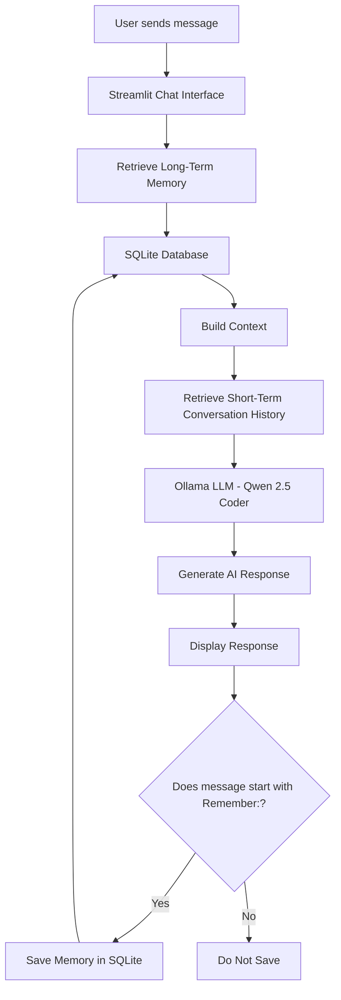

# AI Memory Chatbot Architecture

```mermaid
flowchart TD
    A[User sends message] --> B[Streamlit Chat Interface]
    B --> C[Retrieve Long-Term Memory]
    C --> D[SQLite Database]
    D --> E[Build Context]
    E --> F[Retrieve Short-Term Conversation History]
    F --> G[Ollama LLM - Qwen 2.5 Coder]
    G --> H[Generate AI Response]
    H --> I[Display Response]
    I --> J{Does message start with Remember:?}
    J -->|Yes| K[Save Memory in SQLite]
    J -->|No| L[Do Not Save]
    K --> D
```
